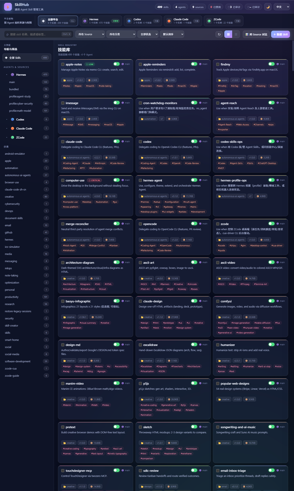

# SkillHub

> 本地优先的 Agent Skill 控制平面：统一发现、检索、比较和管理 Hermes、Codex、Claude Code 与 ZCode 的 Skills。

[](https://github.com/liuhaolin07/skillhub/actions/workflows/ci.yml)
[](https://www.python.org/)
[](LICENSE)



## 为什么做 SkillHub

Agent Skills 往往散落在多个工具、用户目录和 Profile 中。SkillHub 把这些目录组织成一个可视化平台，让你快速回答：

- 现在一共有多少 Skill，分别属于哪个 Agent 和实例？
- 同名 Skill 是否在多个来源重复，版本是否一致？
- 哪些来源可以管理，哪些来源应保持只读？
- 如何搜索、预览、启停、迁移或编辑 Skill，而不手工翻目录？

## 特性

- **多 Agent 发现**：Hermes、Codex、Claude Code、ZCode
- **平台级信息架构**：Agent → Instance/Source → Category → Skill
- **🛡️ 静态安全审计**：可选集成 [agent-skill-scanner](https://github.com/liuhaolin07/agent-skill-scanner)，一键扫描 Skill 中的 Shell 执行、密钥访问、网络调用等风险模式，风险徽章直达卡片，详情页给出危害解释、修复建议与证据行号
- **组合筛选**：来源、分类、Agent、状态、关键字与排序可叠加
- **Skill 管理**：创建、编辑、删除、启停、子文件读写与跨来源迁移
- **权限边界**：Hermes 来源可管理；外部 Agent 来源默认只读
- **本地优先**：默认仅监听 `127.0.0.1`，无账号、无遥测、无云端数据库
- **安全文件访问**：索引定位真实目录，阻止路径穿越
- **响应式界面**：桌面、平板和移动端均可使用
- **中英双语与深浅主题**

## 快速开始

### 使用 uv（推荐）

```bash
# 从 GitHub 安装为隔离的命令行工具
uv tool install "git+https://github.com/liuhaolin07/skillhub.git"

# 启动
skillhub
```

### 从源码运行

```bash
git clone https://github.com/liuhaolin07/skillhub.git
cd skillhub
uv sync --extra dev
uv run skillhub
```

然后打开 <http://127.0.0.1:8080>。

> Windows 用户可运行 `scripts/restart-windows.ps1` 在后台重启服务。

## 配置与目录发现

SkillHub 优先读取 `HERMES_HOME`：

```bash
# Linux/macOS
export HERMES_HOME="$HOME/.hermes"

# Windows PowerShell
$env:HERMES_HOME = "D:\Hermes"
```

未设置时使用 `~/.hermes`；为兼容已有 Windows 安装，若存在 `D:/Hermes` 也会自动识别。

| Agent | 默认扫描位置 | 权限 |
|---|---|---|
| Hermes | `$HERMES_HOME/skills`、bundled、profiles | 可管理 |
| Codex | `~/.agents/skills`、`~/.codex/skills` | 只读 |
| Claude Code | `~/.claude/skills`、插件缓存 | 只读 |
| ZCode | `~/.zcode/cli/plugins/cache` | 只读 |

启停状态写入 `$HERMES_HOME/config.yaml` 的 `skills.disabled`。

### 可选：安全审计引擎

SkillHub 支持与 [agent-skill-scanner](https://github.com/liuhaolin07/agent-skill-scanner) 集成，为每个 Skill 提供静态安全分析（快速扫描 SKILL.md / 深度扫描全部 Markdown、JSON、YAML）。配置任一即可启用：

```bash
# 方式一：环境变量
export AGENT_SKILL_SCANNER_HOME="/path/to/agent-skill-scanner"

# 方式二：本地配置文件 $HERMES_HOME/skillhub.local.json
{ "scanner_home": "/path/to/agent-skill-scanner" }
```

引擎按文件签名热加载——更新 scanner 仓库后无需重启 SkillHub。未配置时安全 Tab 会显示引导信息，其余功能不受影响。

## CLI

```text
skillhub [--host HOST] [--port PORT]
```

默认：`--host 127.0.0.1 --port 8080`。

> [!WARNING]
> 只有在可信网络且明确理解风险时才使用 `--host 0.0.0.0`。SkillHub 包含文件写入 API，目前定位是本机开发者工具，不是公网多租户服务。

## 项目结构

```text
skillhub/
├─ src/skillhub/
│  ├─ app.py              # 扫描、缓存、HTTP API 与 CLI
│  ├─ security.py         # agent-skill-scanner 适配层（热加载 + 报告缓存）
│  └─ static/             # HTML / CSS / JavaScript
├─ tests/                 # API、扫描、安全边界测试
├─ docs/                  # 架构说明与截图
├─ scripts/               # 平台辅助脚本
├─ .github/workflows/     # CI
└─ pyproject.toml
```

详细设计见 [docs/architecture.md](docs/architecture.md)，API 见 [docs/api.md](docs/api.md)。

## 开发

```bash
uv sync --extra dev
uv run pytest
uv run ruff check src tests
uv build
```

贡献前请阅读 [CONTRIBUTING.md](CONTRIBUTING.md)。安全问题请按 [SECURITY.md](SECURITY.md) 私下报告。

## 路线图

- [ ] 重复 Skill 与版本冲突仪表盘
- [ ] 可配置 Source 注册表
- [ ] 文件系统事件驱动刷新
- [ ] 安全审计批量扫描与风险总览视图
- [ ] 导入/导出与审计日志
- [ ] 可选的身份认证与远程部署模式

## 许可证

[MIT](LICENSE) © 2026 Liu Haolin

> SkillHub 是独立开源项目，与 Hermes、OpenAI、Anthropic 或 Zhipu AI 无官方隶属关系；相关商标归各自所有者。
